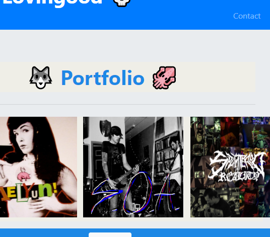

# Mock Profile for a Drummer

## Description
Responsive design ensures that web applications render well on a variety of devices and window or screen sizes. As a developer, I will likely be asked to create a mobile-first application like a Drummer Profile.

## Table of Contents 

* [Usage](#usage)

* [License](#license)

* [Contributing](#contributing)

* [Tests](#tests)

* [Questions](#questions)

## Usage

Go to [DrummerProfile](https://travislovingood.github.io/MockDrummerProfile/) and enjoy.

## License

This project is licensed under the Oh Yeah License.
  
## Contributing

Travis Lovingood

## Questions

If you have any questions about the repo, open an issue or contact directly at [MockDrummerProfileGithub](https://github.com/TravisLovingood/MockDrummerProfile).

